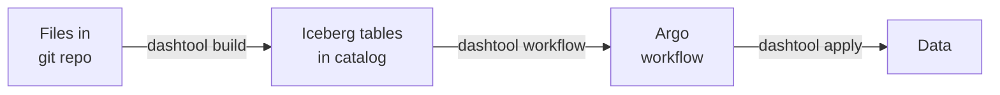

# Dashtool

Dashtool is a Lakehouse build tool that builds Iceberg tables from declarative SQL statements and generates Kubernetes workflows to keep these tables up-to-date.
It handles Ingestion, Transformation and Orchestration.

## Features

- Uses declarative SQL select statements as input
- git inspired data version control
- Interoperability through [Apache Iceberg](https://iceberg.apache.org/) Table format
- Data ingestion through [Airbyte](https://github.com/dashbook/airbyte)
- Data processing based on [Datafusion](https://arrow.apache.org/datafusion/)
- Workflow orchestration in Kubernetes through [Argo Workflows](https://argoproj.github.io/workflows/)

## How it works


Dashtool constructs a DAG by analyzing all `.sql` files in a directory structure and creates an Iceberg Materialized View for every file.
Each file contains a `SELECT` statement for the Materialized View definition.
Additionally, dashtool can use the DAG to create an Argo Workflow that refreshs the Materialized Views.
During the workflow execution Argo starts Docker containers that run Datafusion to perform the refresh operation.

## Examples

- [Postgres example](https://killercoda.com/dashbook/scenario/dashtool-postgres)
- [Mysql example](https://killercoda.com/dashbook/scenario/dashtool-mysql)
- [Kafka example](https://killercoda.com/dashbook/scenario/dashtool-kafka)

## Usage

Dashtool goes through a build, a workflow and an apply step to turn the declarative input files into an automatically refreshing data pipeline. This is shown in the following diagram:



Check out the [Documentation](Documentation.md) for a detailed description.

### Build

The `build` command analyzes all `.sql` files in the subdirectories of the current directory and creates the corresponding Iceberg Materialized Views in the catalog.

```shell
dashtool build
```

### Workflow

The `workflow` command creates a lineage DAG based on the `.sql` files and constructs an Argo workflow based on it. It stores the Workflow configuration file in `argo/workflow.yaml`.

```shell
dashtool workflow
```

### Apply

To apply the latest version of the workflow to the Kubernetes cluster run the following command:

```shell
dashtool apply
```

## Installation

### Homebrew

```shell
brew tap dashbook/dashtool
brew install dashtool
```

### Cargo

```shell
cargo install dashtool
```
